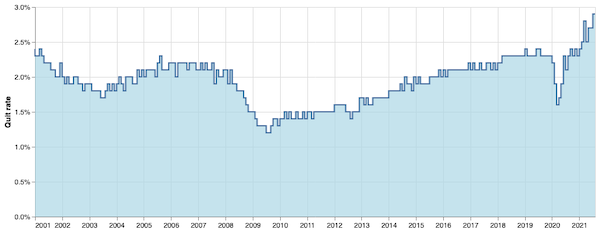

# Are more people in the U.S. quitting their jobs?

Hello from late 2021! This repo has some Python code in [a Jupyter notebook](https://github.com/cjwinchester/quit-rate/blob/main/Quit%20rate.ipynb) to explore one of the numbers behind ["The Great Resignation"](https://www.theatlantic.com/ideas/archive/2021/10/great-resignation-accelerating/620382/) -- at what rate are Americans quitting their jobs? -- which is one of the numbers tracked by the U.S. Bureau of Labor Statistics' [Job Openings and Labor Turnover Survey](https://www.bls.gov/jlt/) (JOLTS).

The output is a quick Altair chart showing that, yes, people sure seem to be quitting their jobs at the highest rates since the BLS started collecting numbers in 2001.

I'm just looking at the top-level number -- the seasonally adjusted quit rate for all industries, all U.S. regions, since 2001, not accounting for preliminary figures -- but [you can change](https://www.bls.gov/help/hlpforma.htm#jt) the `JOLTS_SERIES` variable if you want to look at specific industries or a different measurement or a specific region or whatever.

To run this notebook:
- [Register for an API key with the BLS](https://data.bls.gov/registrationEngine/) ([API docs](https://www.bls.gov/developers/))
- Create an environment variable pointing to your new API key (I called mine `BLS_API_KEY`)
- [Download](https://github.com/cjwinchester/quit-rate/archive/refs/heads/main.zip) or clone this repo
- `cd` into the directory and install the dependencies, hopefully in a virtual environment: `pip install -r requirements.txt`
- Start the server: `jupyter-lab`
